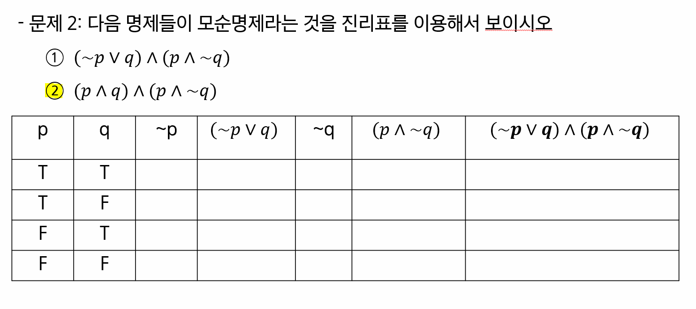
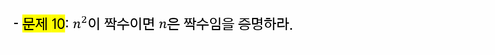

황상필

강민수

진민규

**홍승영**

## 1-2 번

                              

1-2

|  p   |  q   |  ~p  | (~p∨q) |  ~q  | (p∧~q) | (~p∨q)∨(p∧~q) |
| :--: | :--: | :--: | :----: | :--: | :----: | :-----------: |
|  T   |  T   |  F   |   T    |  F   |   F    |       T       |
|  T   |  F   |  F   |   F    |  T   |   T    |       T       |
|  F   |  T   |  T   |   T    |  F   |   F    |       T       |
|  F   |  F   |  T   |   T    |  T   |   F    |       T       |

## 2-2 번  

2-1

|  p   |  q   |  ~p  | (~p∨q) |  ~q  | (p∧~q) | (~p∨q)∧(p∧~q) |
| :--: | :--: | :--: | :----: | :--: | :----: | :-----------: |
|  T   |  T   |  F   |   T    |  F   |   F    |       F       |
|  T   |  F   |  F   |   F    |  T   |   T    |       F       |
|  F   |  T   |  T   |   T    |  F   |   F    |       F       |
|  F   |  F   |  T   |   T    |  T   |   F    |       F       |

2-2
|  p   |  q   |  ~q  | (p∧q) | (p∧~q) | (p∧q)∧(p∧~q) |
| :--: | :--: | :--: | :---: | :----: | :----------: |
|  T   |  T   |  F   |   T   |   F    |      F       |
|  T   |  F   |  T   |   F   |   T    |      F       |
|  F   |  T   |  F   |   F   |   F    |      F       |
|  F   |  F   |  T   |   F   |   F    |      F       |

## 3-2 번

3-2

|  P   |  q   | (p∨q) |  ~p  |  ~q  | ~p ∨ ~q | ~(p∨q) |
| :--: | :--: | :---: | :--: | :--: | :-----: | :----: |
|  T   |  T   |   T   |  F   |  F   |    F    |   F    |
|  T   |  F   |   T   |  F   |  T   |    T    |   F    |
|  F   |  T   |   T   |  T   |  F   |    T    |   F    |
|  F   |  F   |   F   |  T   |  T   |    T    |   T    |

동등하지 않음

## 4-2 번

4-2

### (p∨~q)∧(~p∨~q) => (p∨~p)∧~q => ~q

## 5-2 번 & 5-4번

**5-2번**

모든 정수 x에 대해서, 
$$
x^2 - x >= 0
$$
가 참일 경우, 참

모든 정수에 대해서 참 => 따라서 참

**5-4번**
$$
x^2 - x < 0 이 되는 정수 x가 존재
$$

0 < x < 1 사이의 값이 음수, but x는 정수 => 따라서 거짓

# 7번

## 9번

## 10번

## 11번

## 12번

