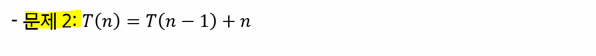

# 연습문제

다음 재귀식들을 O() notation 수준으로 풀어라

## 2 번

- `T(0) = 1`로 설정하고 진행

T(n) = T(n-1) + n = T(n-2) + n + (n-1) = ..... = n + (n-1) + (n-2) + ..... + 1 + T(0) < n + n + n + ...... + T(0)

n이 n개 존재

O(n^2)

## 4번

- `T(1) = 1`로 설정하고 진행

T(n) = T(n/2) + 1 = T(n/4) + 2 = T(n/8) + 3 = ..... = T(n/(2^k)) +k

n/(2^k) = 1 => n = 2^k => k = log2(n)

따라서 T(n) = T(1) + log2(n)

O(log(n))

## 6번

T(n) = 2T(n/2) + n

T(n/2) = 2T(n/4) + n/2 대입

T(n) = 2T(n/2) + n = 4T(n/4) + 2n = 8T(n/8) + 3n = ...... = (2^k)*T(n/(2^k)) + kn

n/(2^k) = 1 => k = log(n)

따라서 nT(1)+ nlog(n)

O(nlog(n))

## 8번

T(n) = T(1) + 1/n + 1/(n-1) + .... +1/2 + 1

1/n + 1/(n-1) + .... +1/2 + 1 <= ∫ from 1 to k (1/k) dk = log(n) - log(1)

=log(n)

O(log(n))

다들 ln(n) = log(n)로 쓴 것 같다

