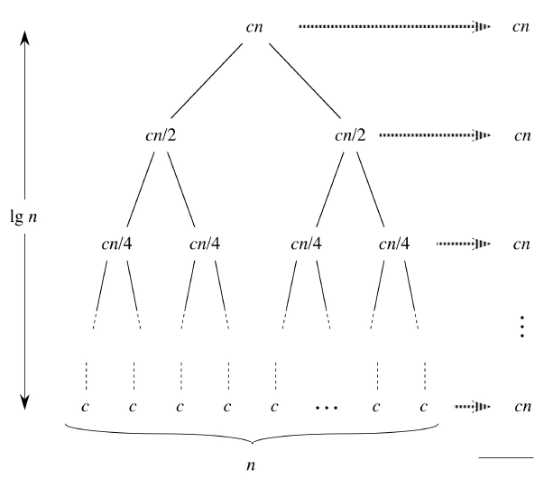

## 2번 - Merge Sort Time Complexity Proof

- Merge Sort가 진행되는 과정을 직접 그려보고 각 단계에서 어떤 일이 일어나는지 생각해보세요.
- 기초 수식에서 학습한 재귀식으로 표현하면 어떻게 되는지 같이 생각해보세요.


```python
def merge_sort(merge_list):
    if len(merge_list) <= 1:
        return merge_list
    mid = len(merge_list) // 2
    left = merge_sort(merge_list[:mid])
    right = merge_sort(merge_list[mid:])
    return merge(left, right)
```




O(nlogn)


## 4번 


(n-1) + (n-2) + .... + 1 = n(n-1)/2

<= n+ n+ .....+n = O(n^2)


## 6번


```python
print(node1, end='')
while node!=child:
    print('--', end='')
    if node==child2:
        print('+', end='')
    else:
        print('-', end='')
    print('--', end='')
    print(child, end='')
    node = child
print()
node, child2 = node1, child
print('    ', end='')
while node!=child:
    if node==child3:
        print('+', end='')
    else:
        print('-', end='')
    print('--', end='')
    print(child, end='')
    node = child
print()
node, child3 = node1, child
print('    ', end='')
while node!=child:
    if node==child4:
        print('+', end='')
    else:
        print('L', end='')
    print('--', end='')
    print(child, end='')
    node = child
    
#틀린걸 알지만,,,, 이런 느낌....
```

